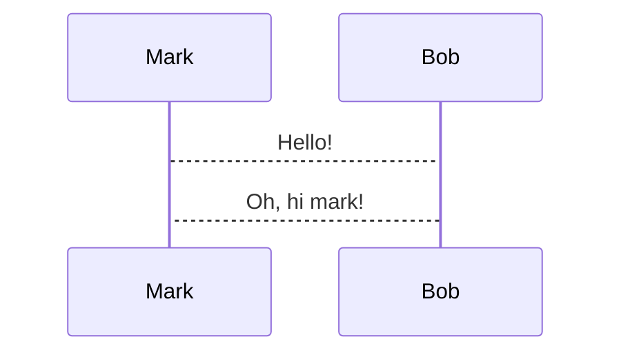

Who am I?
---

# ID: Nabil Hamzi - FdLSifu

<!-- column_layout: [1,1] -->

<!-- column: 0 -->

# Hobbies
* Capture The Flag (team: soudure au beurre)
* Football player and coach
* Crypto, security, programming languages

<!-- column: 1 -->

# Work experience
* Embedded crypto/security developer @ Gemalto (now Thales) [8 years]
* Crypto and Payment expert @ Ingenico [4 years]
* Head of Product Security @ Logitech [4 years]

<!-- reset_layout -->
<!--pause-->
Feel free to ask any questions!!!

<!-- end_slide -->

What will not be covered?
---

* Cryptography internals
* Signal processing
* Hardware
* Power acquisition
* Oscilloscopes
* Electromagnic emanation
* Fault injection
* High order attacks/masking
* Statistical tools
* Deep dive into counter measures
* Secure elements
* Certification

<!-- end_slide -->

What will be covered?
---

* Leakage model
* Hamming weight
* Simple Power Analysis
* Differential Power Analysis
* Correlation Power Analysis
* AES internals
* RSA modular exponentiation
* Key recovery techniques

<!-- end_slide -->
Agenda
---

# Power Analysis
* Grey box attack model
* Leakage model
  * Hamming weight
# Simple Power Analysis
  * RSA
  * Modular exponentiation
  * Hands on
# Differential Power Analysis
  * AES internals
  * Hands on
# Correlation Power Analysis
  * Hands on

<!-- end_slide -->
Set up for the workshop
---
1. Install `docker` and `docker-compose`
1. Clone this git repo: https://github.com/FdLSifu/2024_ph0wn_intro_sca
1. Open terminal and set as current directory the cloned repo
   * Optional: Review `launch_workshop.sh`
1. Run: `$ sh launch_workshop.sh`

We should have a prompt!
<!-- end_slide -->

Power Analysis
---

# Black box attack model

